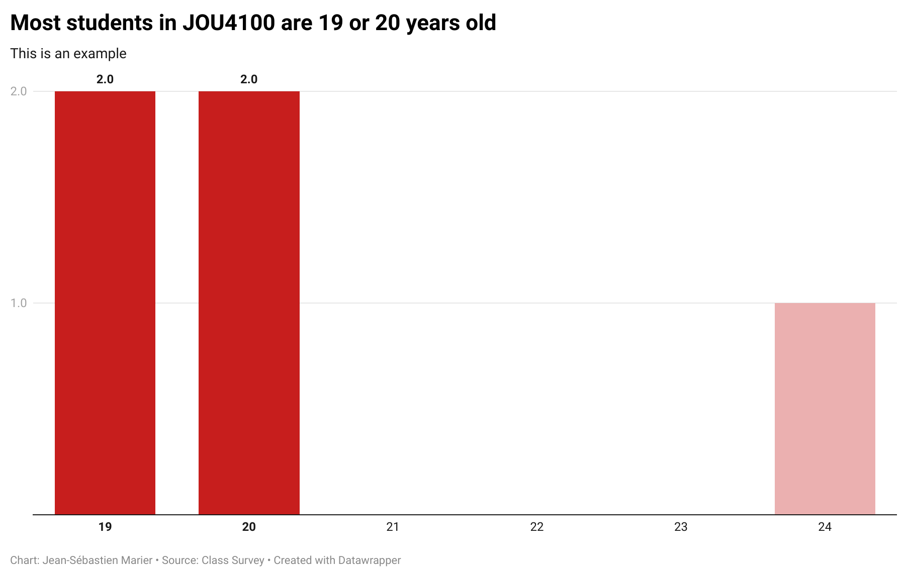

**October 20th, 2023** 
**MPAD2003A** 
**Student's Jayden Proulx** 
**Presented to Jean-Sébastien Marier** 

# Project 1: Audit of a Data Visualization

Use one hashtag symbol (`#`) to create a level 1 heading like this one.

## Foreword

For this assignment, you must write a 1000-1500-word audit/critique of a third-party data visualization. It can come from a multimedia news article, a public health dashboard, a company’s annual report, etc. In this short paper, you must clearly state and describe the type/kind of visualization you are talking about. You must also discuss two of its strengths and two shortcomings. Make sure to give concrete examples, and to cite some of the mandatory readings and/or other relevant sources to support your claims. Don’t forget to include relevant screen captures. Your assignment must be written with the Markdown format and submitted on GitHub Classroom.

**Here are some useful resources for this assignment:**

* [GitHub's *Basic writing and formatting syntax* page](https://docs.github.com/en/github/writing-on-github/getting-started-with-writing-and-formatting-on-github/basic-writing-and-formatting-syntax)
* [The template repository for this assignment in case you delete something by mistake](https://github.com/jsmarier/Template-for-the-Audit-of-a-Data-Visualization)

Did you notice how to create a hyperlink? In Markdown, we put the clickable text between square brackets and the actual URL between parentheses.

And to create an unordered list, we simply put a star (`*`) before each item.

## 1. Introduction

## Data visualization charts are a great tool in today's society for getting precise and easy information. During this critique, I will be analysing information from a bar chart representing the demographics of COVID-19 cases reported in Canada as of May 11th, 2020. The chart I will be analysing, focuses on the percentage of Covid cases by age group. Furthermore, not only will I be just analysing Covid cases by age group but I will also be including the age group with genders. I will be evaluating the strenghs such as the charts simplicity and it's effective use of visual elements. Lastly, I will be evaluating the charts weeknesses in my opinion such as the limited context and the lack of data comparison.  

To include a screen capture, use the sample code below. Your images should be saved in the same folder as your `.md` file.

 
*Figure 1: Screen capture of the data visualization.*

## 2. Strengths

Use two hashtag symbols (`##`) to create a level 2 heading like this one.
## Strenghts

### 2.1. Effective Use of Visual Elements
### One of the major strenghs in this chart is definetly is the effective use of visual elements. When it comes to demographic data, I find it most effective when using a simple chart template to emphasize key statistics. When seeing the chart for the first time, you can easily identify, and retain the key information that the chart presents. According to an article written by Steven L Franconeri, he quotes "communicating with data visualizations is critical for an educated public". I couldn't agree more with that statement and I think with the display of the bar chart it's a very good example of what Franconneri quotes in his article. The chart well examplifies good communication with data. It's very simple, with good titles, subtitles, easy color code and it makes it easy for any viewer to go on the Gouvernment of Canada website, click the chart and they will walk away with the information that they needed/infomation they wanted to know. When I went on to the website to find a chart to analyse for this assignment, I was easily able to look at the chart and determine that with the visual elements, 55% of the COVID cases are among females, and 36% are among individuals aged 60 and older. These percentages are immidiately highlighted that make it easy to takeaway key information from the data. 
Use three hashtag symbols (`###`) to create a level 3 heading like this one. Please follow this template when it comes to level 1 and level 2 headings. However, you can use level 3 headings as you see fit.

### 2.2. Clarity and simplicity

### Another strength provided in the data visualization representing COVID-19 demogtaphics in Canada is the clarity and simplicity. According to an article written by Steven L Franconneri, he quotes "Compared with the slow difficulty of reading and comparing symbolic numbers, a visualization can allow these steps to unfold far more quickly and efficiently". This visualization achieves that by exmploying a simple/clear chart format. The use of the horiznontal bar chart to represent the gender/age distribution  of COVID 19 cases is a good and simple way to establish data in data visualization. This form of chart is more of a broad form of displaying visual information but this chart form is known to be easily interpretable even by individuals who aren't familiar with data visualization. The chart well seperates the male and female cases and the age group categories allows viewers to understand the key demogtaphics of the COVID cases in Canada. This format ensures that the audience can quicky go online, find the chart, and quicly get essential information they need. Finally, the bar chart presented promotes effective communication to the viewer by avoiding complexity. Sometimes when viewing other charts they get too complex, there's so much color, information, numbers. That is not the case here. This chart avoids all complexity and really allows any viewer to gain any key information they need in just a matter of minutes. 

Support your claims by citing relevant sources. Please follow [APA guidelines for in-text citations](https://apastyle.apa.org/style-grammar-guidelines/citations).

**For example:**

As Cairo (2016) argues, a data visualization should be truthful...

## 3. Weaknesses

### 3.1. Lack Of Context

### A very notable weekness of the data visualization chart displaying information on the COVID 19 demographics in Canada is the lack of contextual information. Having context when looking for visual data is very important. It's a very important aspect for data interpretation. For example, the chart highlights that 55% of COVID 19 cases are among females and 36% are among individuals aged 60 and older. While that might be key information and easy information to obtain, the chart is missing context. It leaves the viewers with some unanswered questions such as why and what are driving these percentages. What I would do to fix it would be to add narratives without making the visualization too complex as the chart already displays simplicity and clairty. I would include information such as elements that are driving these numbers and why the numbers are what they are. According to a Tech Target article, they highlight examples of why data visualization is important. One of the examples that stuck out to me was "an increased understanding of the next steps that must be taken to improve the organization". With that being said I think that the visualization could highlight basic information such as older people are more receptive to severe illness which could jump the count of cases of COVID. Little narratives and additional information implemented on this visualization would answer questions that any viewer would have. While this visualization is very simple and does highlight key information for the viewer, adding little information would leave less viewers with questions and more viewers with retained key information.

### 3.1. 

Insert text here.

## 4. Conclusion

Thank you for reading my report.

## 5. References

Include a list of your references here. Please follow [APA guidelines for references](https://apastyle.apa.org/style-grammar-guidelines/references). Hanging paragraphs aren't required though.

**Here's an example:**

Bounegru, L., & Gray, J. (Eds.). (2021). *The Data Journalism Handbook 2: Towards A Critical Data Practice*. Amsterdam University Press. [https://ocul-crl.primo.exlibrisgroup.com/permalink/01OCUL_CRL/hgdufh/alma991022890087305153](https://ocul-crl.primo.exlibrisgroup.com/permalink/01OCUL_CRL/hgdufh/alma991022890087305153)
