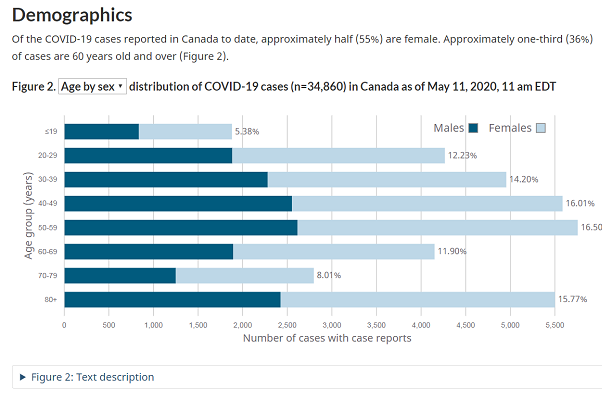

**October 20th, 2023** 
**MPAD2003A** 
**Student's Jayden Proulx** 
**Presented to Jean-Sébastien Marier** 

# Project 1: Audit of a Data Visualization

https://github.com/JMoneyProulx/mpad2003_project1_-Jayden-Proulx-.git

## 1. Introduction

Data visualization charts are a great tool in today's society for getting precise and easy information. During this critique, I will be analysing information from a bar chart representing the demographics of COVID-19 cases reported in Canada as of May 11th, 2020. The chart I will be analysing, focuses on the percentage of Covid cases by age group. Furthermore, not only will I be just analysing Covid cases by age group but I will also be including the age group with genders. I will be evaluating the strenghs such as the charts simplicity and it's effective use of visual elements. Lastly, I will be evaluating the charts weeknesses in my opinion such as the limited context and the lack of data comparison.  

 
*Figure 1: Screen capture of the data visualization.*

## 2. Strengths

## 2.1. Effective Use of Visual Elements
One of the major strenghs in this chart is definetly is the effective use of visual elements. When it comes to demographic data, I find it most effective when using a simple chart template to emphasize key statistics. When seeing the chart for the first time, you can easily identify, and retain the key information that the chart presents. According to an article written by Steven L Franconeri, he quotes "communicating with data visualizations is critical for an educated public". I couldn't agree more with that statement and I think with the display of the bar chart it's a very good example of what Franconneri quotes in his article. The chart well examplifies good communication with data. It's very simple, with good titles, subtitles, easy color code and it makes it easy for any viewer to go on the Gouvernment of Canada website, click the chart and they will walk away with the information that they needed/infomation they wanted to know. When I went on to the website to find a chart to analyse for this assignment, I was easily able to look at the chart and determine that with the visual elements, 55% of the COVID cases are among females, and 36% are among individuals aged 60 and older. These percentages are immidiately highlighted that make it easy to takeaway key information from the data. 

### 2.2. Clarity and simplicity

 Another strength provided in the data visualization representing COVID-19 demogtaphics in Canada is the clarity and simplicity. According to an article written by Steven L Franconneri, he quotes "Compared with the slow difficulty of reading and comparing symbolic numbers, a visualization can allow these steps to unfold far more quickly and efficiently". This visualization achieves that by exmploying a simple/clear chart format. The use of the horiznontal bar chart to represent the gender/age distribution  of COVID 19 cases is a good and simple way to establish data in data visualization. This form of chart is more of a broad form of displaying visual information but this chart form is known to be easily interpretable even by individuals who aren't familiar with data visualization. The chart well seperates the male and female cases and the age group categories allows viewers to understand the key demogtaphics of the COVID cases in Canada. This format ensures that the audience can quicky go online, find the chart, and quicly get essential information they need. Finally, the bar chart presented promotes effective communication to the viewer by avoiding complexity. Sometimes when viewing other charts they get too complex, there's so much color, information, numbers. That is not the case here. This chart avoids all complexity and really allows any viewer to gain any key information they need in just a matter of minutes. 

## 3. Weaknesses

### 3.1. Lack Of Context

A very notable weekness of the data visualization chart displaying information on the COVID 19 demographics in Canada is the lack of contextual information. Having context when looking for visual data is very important. It's a very important aspect for data interpretation. For example, the chart highlights that 55% of COVID 19 cases are among females and 36% are among individuals aged 60 and older. While that might be key information and easy information to obtain, the chart is missing context. It leaves the viewers with some unanswered questions such as why and what are driving these percentages. What I would do to fix it would be to add narratives without making the visualization too complex as the chart already displays simplicity and clairty. I would include information such as elements that are driving these numbers and why the numbers are what they are. According to an written by Kate Brush, they highlight examples of why data visualization is important. One of the examples that stuck out to me was "an increased understanding of the next steps that must be taken to improve the organization". With that being said I think that the visualization could highlight basic information such as older people are more receptive to severe illness which could jump the count of cases of COVID. Little narratives and additional information implemented on this visualization would answer questions that any viewer would have. While this visualization is very simple and does highlight key information for the viewer, adding little information would leave less viewers with questions and more viewers with retained key information.

### Data Comparison 

 Another weakness of the data visualization is the lack of data comparison. In my opinion this is an important element for viewers to understand the significance of the demographic patterns. According to an article written by Ross Jenkins, he quotes "When data is communicated well, it bridges the gap between raw data and knowledge, engaging audiences at an emotional level and making the information more memorable for them." The visualization presents percentages of COVID 19 cases only from Canada without comparing it to other countries. Jenkins makes a good point. The visualization presents "raw data" compared to knwoeldgeable data. Yes you gain key information about the COVID cases in Canada but you don't get the complete knowledge of these COVID cases compared to other countries across the world. COVID was a huge element in the world for the span of 3-4 years. Even today, people are still dealing with COVID and it's effecting people short and long term. The visualiztion would've been more complete had it been compared to other countries. This would've allowed viewers to see how the country we live in (Canada) compares to different countries. People would be able to analyse which countries have more cases than others, which age range is getting more effected without doing any extra research for imformation. The lack of comparison brings me back to my first weakness of leaving the viewers with questions. The viewers want to know that information and by seeing and analysing the graph they question the comparison to other countries. What I would've done would've been is incorporate a side by side chart that comapres Canada's demographic with other countries from arounf the world so viewers could get a glimpse of what's happening around the world. Viewers would also get valuable context to make comparisons. 

## 4. Conclusion

In conclusion, the visualization provides good strenghts such as the clarity and simplicity of the graph & its effective use of visual elements that really make it easy to understand and retain key information. Meanwhile, the visualization lacks context and comparison that could leave viewers with questions such as why the numbers are the way they are. My main takeaway is that data visualization isn't easy. It's very difficult to have the perfect visual as some visualizations are very broad and simple and some are too complex. For the future, it's nice to know what I need to include if I were to ever create a visual and what elements are more important than others. 

## 5. References

**Work Cited**
Franconeri, S. L., Padilla, L. M., Shah, P., Zacks, J. M., & Hullman, J. (2021). The Science of Visual Data Communication: What Works. Psychological Science in the Public Interest, 22(3), 110-161. https://doi.org/10.1177/15291006211051956

Brush, Kate, Data Visualization, Tech Target: https://www.techtarget.com/searchbusinessanalytics/definition/data-visualization

Jenkins, Ross, The Value of Effective Data Communication, Decision Foundry: https://www.decisionfoundry.com/misc/articles/the-value-of-effective-data-communication/

